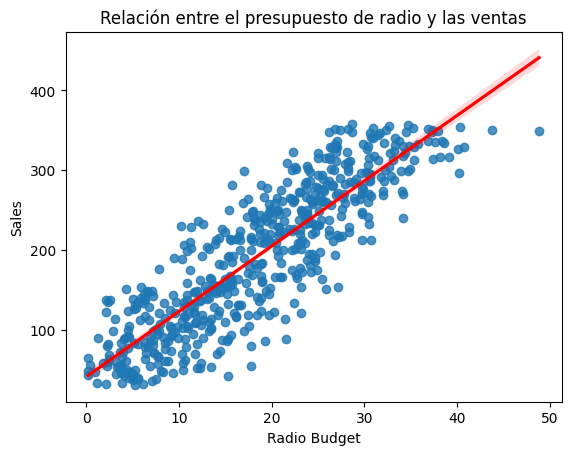

# 📌 Executive Summary — Marketing Sales Analysis

## 🎯 Objetivo
Identificar qué canal de marketing tiene mayor impacto en las ventas mediante un análisis exploratorio y un modelo de regresión lineal.

## 🔍 Insight Clave
Un canal publicitario muestra una relación lineal fuerte y significativa con las ventas, explicando más del **75%** de la variación total.

## 📈 Evidencia Visual

La pendiente positiva y el ajuste del modelo confirman la consistencia del impacto.

## 💡 Recomendación Principal
Priorizar el canal identificado dada su alta efectividad comprobada en generar ventas.  
Reasignar presupuesto desde medios de menor impacto para maximizar el retorno de inversión.

## 📁 Accesos Rápidos
- 📘 Notebook: [notebooks/marketing_sales_analysis.ipynb](notebooks/marketing_sales_analysis.ipynb)
- 📄 PACE: [reports/PACE-Marketing_Sales.pdf](reports/PACE-Marketing_Sales.pdf)
- 📊 Resumen Ejecutivo: [reports/Resumen_Ejecutivo.pdf](reports/Resumen_Ejecutivo.pdf)
- 📚 README Completo: [README.md](README.md)

