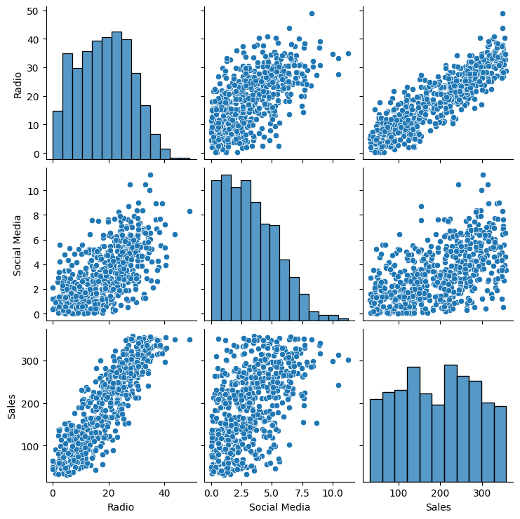

# 📊 Identificación de Drivers de Ventas en Estrategias de Marketing
**EDA + Regresión Lineal | Proyecto de Análisis Predictivo**


---

## 🧠 Sobre el Proyecto

Este proyecto analiza cómo diferentes inversiones en marketing se relacionan con las ventas, buscando identificar **qué canal tiene mayor impacto en los resultados comerciales**.

El proceso incluyó:

- Exploración de patrones y correlaciones entre medios.
- Visualización de relaciones clave mediante gráficos comparativos.
- Construcción de un modelo de regresión lineal.
- Validación de supuestos estadísticos del modelo.
- Presentación ejecutiva mediante un one‑pager y documentos PACE.

El análisis identificó un medio con **impacto fuerte y estadísticamente significativo**, explicando más del **75%** de la variación en ventas.

---

## 📊 Principales Resultados

- Un canal publicitario muestra **relación lineal positiva muy sólida** con las ventas.
- El modelo arroja **R² = 0.757**, indicando alta capacidad explicativa.
- La relación cumple supuestos de linealidad, normalidad, independencia y homocedasticidad.
- Otros medios presentan correlaciones más débiles o dispersas.

---

## 🗂️ Estructura del Repositorio

```
Marketing Sales Analysis/
│
├── data/
│   └── marketing_sales_data.csv
│
├── notebooks/
│   └── marketing_sales_analysis.ipynb
│
├── reports/
│   ├── marketing_sales_analysis.pdf
│   ├── PACE-Marketing_Sales.pdf
│   └── Resumen_Ejecutivo.pdf
│
├── images/
│   ├── dispersion_por_pares.png
│   ├── grafico_q-q.png
│   ├── histograma_de_residuos.png
│   ├── linea_de_regresion.png
│   └── valores_ajustados_vs_residuos.png
│
├── requirements.txt
│
└── README.md
```

---

## 📄 Documentos del Proyecto

| Tipo | Archivo |
|------|---------|
| 📘 Notebook interactivo | notebooks/marketing_sales_analysis.ipynb (notebooks/marketing_sales_analysis.ipynb)|
| 📄 PACE (Metodología) | reports/PACE-Marketing_Sales.pdf (reports/PACE-Marketing_Sales.pdf)|
| 📊 Resumen Ejecutivo | reports/Resumen_Ejecutivo.pdf (reports/Resumen_Ejecutivo.pdf)|
| 🗂 Dataset | data/marketing_sales_data.csv (data/marketing_sales_data.csv)|

---

## 🧪 Tecnologías y Librerías

- Python 3
- Pandas
- NumPy
- Matplotlib
- Seaborn
- Statsmodels
- Jupyter Notebook

Requisitos completos en  
📦 **requirements.txt**

---

## 📈 Visualizaciones

### 🔹 Pairplot — Relaciones entre variables de marketing


**Muestra patrones de correlación iniciales entre canales y ventas.**

---

### 🔹 Regresión Lineal — Canal con mayor impacto


**Evidencia una relación lineal fuerte y consistente con las ventas.**

---

## 🚀 Próximos Pasos

- Ampliar el análisis hacia un modelo multivariable.
- Evaluar interacciones entre medios y efectos combinados.
- Probar modelos no lineales o machine learning para comparación.
- Construir un dashboard simple de experimentación presupuestal.

---

## 📬 Autor

**Frankz Camasca**  
Analista de Datos | Data Analytics & Predictive Modeling  

[](https://github.com/fcamasca)
[](https://www.linkedin.com/in/frankz-william-camasca-castillo-b63a0094)
